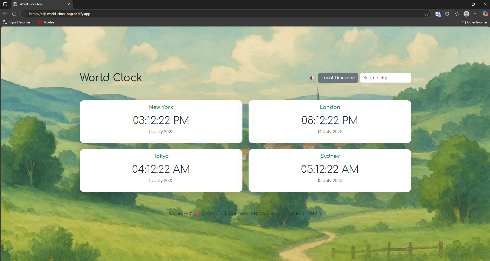
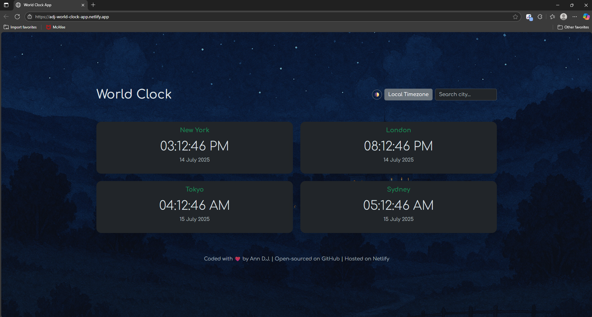

# 🌍 World Clock App

A responsive, theme-aware web app that shows the current time and date for popular global cities — with the ability to search for any city using its timezone via the OpenCage Geocoding API.

## 🚀 Live Demo

👉 [Live on Netlify](https://adj-world-clock-app.netlify.app/)

---

## 📌 Features

- 🕰 **Real-Time Clocks**: Shows live time and date for New York, London, Tokyo, and Sydney.
- 🌐 **City Search**: Search any city worldwide and display its current local time.
- 📍 **Local Time Detection**: Click to instantly show your device's current timezone.
- 🌗 **Dark/Light Mode**: Toggle between light and dark themes with smooth background transitions.
- 📱 **Responsive Design**: Mobile-first, fully responsive layout using Bootstrap 5.
- 🎨 **Custom Styling**: Ghibli-inspired backgrounds and a soft `Comfortaa` font for a modern, friendly UI.

---

## 🛠️ Built With

- **HTML5**, **CSS3**, **JavaScript (ES6+)**
- [Bootstrap 5](https://getbootstrap.com/)
- [Moment.js](https://momentjs.com/) + [Moment Timezone](https://momentjs.com/timezone/)
- [OpenCage Geocoding API](https://opencagedata.com/)
- Hosted on [Netlify](https://netlify.com/)

---

## 🔍 How It Works

- Default: Shows four global cities using predefined timezones.
- Search: Uses OpenCage API to find a city, get its timezone, and display its clock.
- Local: Auto-detects user timezone with `moment.tz.guess()`.
- Updates: Clock refreshes every second using `setInterval`.

---

## 📷 Screenshots

---

## 🧑‍💻 Developer

**Ann D.J.**  
📂 [GitHub Profile](https://github.com/ann-era)

---

## 🧠 A Note

This project was built to strengthen my frontend development skills. Particularly in responsive design, working with APIs, and managing dynamic UI updates in JavaScript. I'm continuously improving and would love your feedback!
